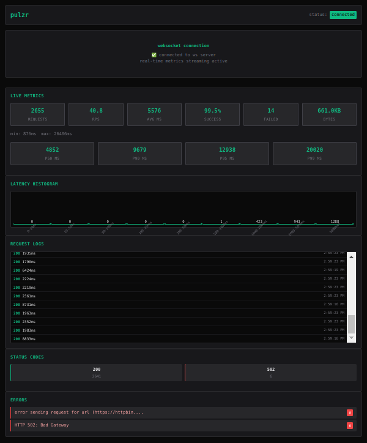

# Pulzr ⚡

[](https://www.rust-lang.org/)
[](https://opensource.org/licenses/MIT)
[](https://github.com/arnonsang/pulzr/releases)
[](https://github.com/arnonsang/pulzr/stargazers)
[](https://github.com/arnonsang/pulzr/actions)

A load testing tool written in Rust with TUI and WebUI interfaces for comprehensive performance testing.


> ⚠️**Note:** This is a my rust practice project I put together in just 2 days to explore a use case of my own.
> I’m still pretty new to Rust, but I’ve really loved it since my first try!
>
> The code isn’t production-ready, but I’ve done my best to follow good practices where I can.
>
> If you find any issues or have suggestions, feel free to open an issue or pull request — I’d really appreciate it!





## Key Features

- **Fast & Concurrent**: Multi-threaded load testing with configurable concurrency
- **WebSocket Streaming**: Real-time metrics broadcasting for external integrations
- **User-Agent Management**: Custom, random, or file-based User-Agent rotation (25+ built-in agents)
- **Rate Limiting**: Precise RPS control with token bucket algorithm
- **CSV Export**: Detailed request logs and aggregated summary reports
- **Flexible HTTP**: Support for all HTTP methods, custom headers, JSON/form payloads
- **Scenario Testing**: JSON/YAML config files for complex multi-step tests
- **Ramp-up Patterns**: Gradual load increase with linear, exponential, or step patterns
- **Multiple Endpoints**: Test different APIs simultaneously with weighted distribution
- **Debug Mode**: Detailed request/response logging with 3 verbosity levels
- **Authentication**: JWT tokens with auto-refresh and API key support
- **Prometheus Export**: Standard metrics endpoint for monitoring integrations
- **Memory Optimization**: Streaming stats with bounded memory usage for long tests
- **HTTP/2 Support**: Modern protocol with multiplexing and header compression

## Installation

### Quick Install (Recommended)
```bash
curl -fsSL https://raw.githubusercontent.com/arnonsang/pulzr/main/install.sh | bash
```

### From Source
```bash
git clone https://github.com/arnonsang/pulzr.git
cd pulzr
cargo install --path .
```

### From GitHub Releases
Download pre-compiled binaries from [GitHub Releases](https://github.com/arnonsang/pulzr/releases)

**Available platforms:**
- Linux x86_64 (amd64)
- Windows x86_64 (amd64)
- macOS x86_64 (amd64)
- macOS ARM64 (Apple Silicon)

**Note for ARM64 Linux users:** Pre-compiled binaries are not available for ARM64 Linux. Please build from source using the instructions above.


## Quick Start

### Basic Load Test (TUI Mode)
```bash
# Run until manually stopped (Ctrl+C or 'q')
pulzr --url https://httpbin.org/get -c 10

# Run for specific duration
pulzr --url https://httpbin.org/get -c 10 -d 30

# Run for specific number of requests
pulzr --url https://httpbin.org/get -c 10 -n 500
```

### WebUI Mode (Recommended)
```bash
# Clean web interface - run until stopped
pulzr --url https://httpbin.org/get --webui --open-browser -c 10

# WebUI with specific duration
pulzr --url https://httpbin.org/get --webui --open-browser -c 10 -d 30

# Request count mode - run exactly 1000 requests
pulzr --url https://httpbin.org/get --webui --open-browser -c 10 -n 1000
```

## Table of Contents

- [Pulzr ⚡](#pulzr-)
  - [Key Features](#key-features)
  - [Installation](#installation)
    - [Quick Install (Recommended)](#quick-install-recommended)
    - [From Source](#from-source)
    - [From GitHub Releases](#from-github-releases)
  - [Quick Start](#quick-start)
    - [Basic Load Test (TUI Mode)](#basic-load-test-tui-mode)
    - [WebUI Mode (Recommended)](#webui-mode-recommended)
  - [Table of Contents](#table-of-contents)
  - [Usage Examples](#usage-examples)
    - [🌐 WebUI Testing](#-webui-testing)
    - [📊 TUI Testing](#-tui-testing)
    - [🔧 HTTP Methods \& Payloads](#-http-methods--payloads)
    - [📈 Data Export \& Analysis](#-data-export--analysis)
    - [🎯 Specialized Testing](#-specialized-testing)
    - [⚡ Performance Testing](#-performance-testing)
    - [📝 Scenario-Based Testing](#-scenario-based-testing)
    - [📈 Ramp-up Load Testing](#-ramp-up-load-testing)
    - [🔗 Multiple Endpoints Testing](#-multiple-endpoints-testing)
    - [🔗 Integration Testing](#-integration-testing)
    - [Command Line Options](#command-line-options)
  - [� Output Formats](#-output-formats)
    - [Available Formats](#available-formats)
    - [Output Format Examples](#output-format-examples)
      - [Detailed Format (Default)](#detailed-format-default)
      - [Compact Format](#compact-format)
      - [Minimal Format](#minimal-format)
      - [Quiet Mode](#quiet-mode)
    - [Compatible CLI Syntax](#compatible-cli-syntax)
    - [Alternative Output Formats](#alternative-output-formats)
    - [Output Control Options](#output-control-options)
    - [Migration Examples](#migration-examples)
  - [📝 Scenario Files](#-scenario-files)
    - [✨ Features:](#-features)
    - [📋 Example JSON Scenario:](#-example-json-scenario)
    - [📋 Example YAML Scenario:](#-example-yaml-scenario)
    - [🚀 Scenario Usage:](#-scenario-usage)
    - [⚙️ Scenario Configuration:](#️-scenario-configuration)
    - [🎯 Step Configuration:](#-step-configuration)
    - [🔄 Variable Substitution:](#-variable-substitution)
    - [📊 Weighted Distribution:](#-weighted-distribution)
  - [📈 Ramp-up Patterns](#-ramp-up-patterns)
    - [✨ Features:](#-features-1)
    - [📊 Ramp-up Patterns:](#-ramp-up-patterns-1)
      - [1. **Linear Pattern** (`--ramp-pattern linear`)](#1-linear-pattern---ramp-pattern-linear)
      - [2. **Exponential Pattern** (`--ramp-pattern exponential`)](#2-exponential-pattern---ramp-pattern-exponential)
      - [3. **Step Pattern** (`--ramp-pattern step`)](#3-step-pattern---ramp-pattern-step)
    - [🚀 Ramp-up Usage Examples:](#-ramp-up-usage-examples)
    - [⚙️ Ramp-up Configuration:](#️-ramp-up-configuration)
    - [📊 Ramp-up Behavior:](#-ramp-up-behavior)
    - [💡 Best Practices:](#-best-practices)
  - [🔗 Multiple Endpoints](#-multiple-endpoints)
    - [✨ Features:](#-features-2)
    - [📋 Example Endpoints Configuration:](#-example-endpoints-configuration)
      - [JSON Format:](#json-format)
    - [🚀 Multiple Endpoints Usage:](#-multiple-endpoints-usage)
    - [⚙️ Endpoint Configuration:](#️-endpoint-configuration)
    - [📊 Weighted Distribution:](#-weighted-distribution-1)
    - [💡 Use Cases:](#-use-cases)
      - [**Microservices Testing**:](#microservices-testing)
      - [**API Gateway Load Testing**:](#api-gateway-load-testing)
      - [**CI/CD Integration Testing**:](#cicd-integration-testing)
      - [**Capacity Planning**:](#capacity-planning)
    - [🎯 Best Practices:](#-best-practices-1)
  - [🐛 Debug Mode](#-debug-mode)
    - [✨ Features:](#-features-3)
    - [📋 Debug Levels:](#-debug-levels)
      - [**Level 1: Basic** (`--debug-level 1`)](#level-1-basic---debug-level-1)
      - [**Level 2: Headers** (`--debug-level 2`)](#level-2-headers---debug-level-2)
      - [**Level 3: Full** (`--debug-level 3`)](#level-3-full---debug-level-3)
    - [🚀 Debug Usage Examples:](#-debug-usage-examples)
    - [📋 Debug Output Example:](#-debug-output-example)
    - [🎯 Use Cases:](#-use-cases-1)
      - [**API Development \& Testing**:](#api-development--testing)
      - [**Issue Troubleshooting**:](#issue-troubleshooting)
      - [**Performance Analysis**:](#performance-analysis)
      - [**Authentication Debugging**:](#authentication-debugging)
    - [💡 Debug Best Practices:](#-debug-best-practices)
    - [⚠️ Important Notes:](#️-important-notes)
  - [🌐 Web Dashboard](#-web-dashboard)
    - [✨ Features:](#-features-4)
    - [🎮 WebUI vs TUI:](#-webui-vs-tui)
    - [💡 Usage Examples:](#-usage-examples)
  - [📡 WebSocket API](#-websocket-api)
    - [🔌 Connection](#-connection)
    - [📨 Message Types](#-message-types)
    - [📋 Message Examples](#-message-examples)
      - [Test Started](#test-started)
      - [Metrics Update](#metrics-update)
      - [Request Log (New!)](#request-log-new)
    - [🔗 Integration Examples](#-integration-examples)
      - [JavaScript WebSocket Client](#javascript-websocket-client)
      - [Python Monitoring Script](#python-monitoring-script)
  - [CSV Export](#csv-export)
  - [User-Agent Management](#user-agent-management)
    - [Random User-Agents](#random-user-agents)
    - [Custom User-Agent File](#custom-user-agent-file)
  - [TUI Interface](#tui-interface)
    - [TUI Features:](#tui-features)
    - [When to Use TUI vs WebUI:](#when-to-use-tui-vs-webui)
    - [TUI Controls:](#tui-controls)
    - [TUI Examples:](#tui-examples)
  - [Advanced Metrics \& Monitoring](#advanced-metrics--monitoring)
    - [✨ Advanced Metrics Features:](#-advanced-metrics-features)
    - [📋 Percentile Metrics:](#-percentile-metrics)
    - [📊 Latency Histograms:](#-latency-histograms)
    - [🚨 Smart Alerts:](#-smart-alerts)
    - [📉 Performance Degradation Detection:](#-performance-degradation-detection)
  - [🔐 Authentication \& Security](#-authentication--security)
    - [Authentication Features:](#authentication-features)
    - [JWT Authentication:](#jwt-authentication)
    - [API Key Authentication:](#api-key-authentication)
    - [Security Best Practices:](#security-best-practices)
  - [Prometheus Export \& Monitoring](#prometheus-export--monitoring)
    - [Prometheus Features:](#prometheus-features)
    - [Prometheus Setup:](#prometheus-setup)
    - [Grafana Dashboard Integration:](#grafana-dashboard-integration)
    - [Integration Example:](#integration-example)
  - [Memory Optimization](#memory-optimization)
    - [Memory Optimization Features:](#memory-optimization-features)
    - [Memory Profiles:](#memory-profiles)
    - [Memory Configuration Options:](#memory-configuration-options)
    - [Memory Monitoring:](#memory-monitoring)
  - [HTTP/2 Support](#http2-support)
    - [HTTP/2 Features:](#http2-features)
    - [HTTP/2 Configuration:](#http2-configuration)
    - [HTTP/2 Configuration Options:](#http2-configuration-options)
    - [Protocol Information:](#protocol-information)
    - [Performance Benefits:](#performance-benefits)
    - [HTTP/2 Best Practices:](#http2-best-practices)
  - [Real-World Examples](#real-world-examples)
    - [API Testing with WebUI](#api-testing-with-webui)
    - [Performance Benchmarking](#performance-benchmarking)
    - [Stealth \& Security Testing](#stealth--security-testing)
    - [CI/CD Integration](#cicd-integration)
  - [License](#license)

## Usage Examples

### 🌐 WebUI Testing
```bash
# Simple WebUI test with auto-browser opening (unlimited duration)
pulzr --url https://httpbin.org/get --webui --open-browser

# Production API test with WebUI (runs until stopped)
pulzr --url https://httpbin.org/get --webui --open-browser \
      -c 25 -r 10 --random-ua

# Load test with custom payload and specific duration
pulzr --url https://httpbin.org/post --method post \
      --payload '{"title": "test", "body": "content"}' \
      --webui --open-browser -c 15 -d 45
```

### 📊 TUI Testing
```bash
# Basic TUI load test
pulzr --url https://httpbin.org/get -c 10 -d 30

# High-concurrency test with rate limiting
pulzr --url https://httpbin.org/get -c 50 -r 100 -d 120

# Stealth testing with random User-Agents
pulzr --url https://httpbin.org/user-agent --random-ua -c 3 -r 5 -d 300
```

### 🔧 HTTP Methods & Payloads
```bash
# POST JSON data
pulzr --url https://httpbin.org/post --method post \
      --payload '{"key": "value", "test": true}' -c 5

# PUT request with custom headers
pulzr --url https://httpbin.org/put --method put \
      --payload '{"name": "updated"}' \
      --headers "Authorization: Bearer token123" \
      --headers "Content-Type: application/json"

# DELETE request test
pulzr --url https://httpbin.org/delete --method delete \
      --headers "Authorization: Bearer token123" -c 3 -d 10
```

### 📈 Data Export & Analysis
```bash
# Export detailed CSV reports
pulzr --url https://httpbin.org/get -c 20 -d 60 --output load_test_results

# WebUI with CSV export
pulzr --url https://httpbin.org/get --webui --output results \
      -c 15 -r 25 -d 90 --random-ua

# Headless mode with CSV only
pulzr --url https://httpbin.org/get --headless --output batch_test \
      -c 30 -d 120 -r 50
```

### 🎯 Specialized Testing
```bash
# Error testing (expect failures)
pulzr --url https://httpbin.org/status/500 --webui -c 5 -d 30

# Redirect testing
pulzr --url https://httpbin.org/redirect/3 --webui -c 5 -d 20

# Custom User-Agent testing
pulzr --url https://httpbin.org/user-agent --user-agent "MyBot/2.0" \
      --webui -c 10 -d 45

# File-based User-Agent rotation
echo -e "Bot-1/1.0\nBot-2/1.0\nBot-3/1.0" > agents.txt
pulzr --url https://httpbin.org/user-agent --ua-file agents.txt --webui -c 5
```

### ⚡ Performance Testing
```bash
# High-throughput test
pulzr --url https://httpbin.org/get -c 100 -r 500 -d 300 --headless

# Sustained load test
pulzr --url https://httpbin.org/get -c 25 -r 50 -d 1800 --webui

# Burst testing
pulzr --url https://httpbin.org/get -c 200 -d 60 --webui

# Request count performance test
pulzr --url https://httpbin.org/get -c 50 -n 10000 --headless --output perf_test
```

### 📝 Scenario-Based Testing
```bash
# JSON scenario file
pulzr --scenario examples/api_test.json --concurrent 10 --duration 60

# YAML scenario file  
pulzr --scenario examples/load_test.yaml --webui --open-browser

# Scenario with custom concurrency and duration
pulzr --scenario examples/complex_test.json -c 25 -d 300 --webui
```

### 📈 Ramp-up Load Testing
```bash
# Linear ramp-up over 30 seconds
pulzr --url https://httpbin.org/get --ramp-up 30 --ramp-pattern linear -c 50

# Exponential ramp-up with WebUI
pulzr --url https://httpbin.org/get --ramp-up 60 --ramp-pattern exponential \
      -c 100 -d 300 --webui --open-browser

# Step ramp-up pattern (25%, 50%, 75%, 100% at quarters)
pulzr --url https://httpbin.org/get --ramp-up 20 --ramp-pattern step -c 20

# Scenario with ramp-up
pulzr --scenario load_test.json --ramp-up 45 --ramp-pattern linear -c 30 -d 180
```

### 🔗 Multiple Endpoints Testing
```bash
# Test multiple API endpoints simultaneously
pulzr --endpoints examples/api_endpoints.json --concurrent 10 --duration 60

# Multi-endpoint test with WebUI
pulzr --endpoints examples/api_endpoints.json --webui --open-browser -c 20 -d 300

# Multi-endpoint with ramp-up pattern
pulzr --endpoints examples/api_endpoints.json --ramp-up 30 --ramp-pattern linear \
      -c 50 -d 600 --webui

# High-throughput multi-endpoint test
pulzr --endpoints examples/api_endpoints.json -c 100 -r 200 -d 1800 --output results
```

### 🔗 Integration Testing
```bash
# WebSocket server for external monitoring
pulzr --url https://httpbin.org/get --websocket --websocket-port 9621 \
      -c 20 -d 120

# Combined WebUI + WebSocket
pulzr --url https://httpbin.org/get --webui --websocket \
      --webui-port 9622 --websocket-port 9621 -c 15 -d 90
```

### Command Line Options

| Option | Short | Description | Default |
|--------|-------|-------------|---------|
| `--url` | | Target URL to test (optional with --scenario) | Required |
| `--scenario` | `-s` | Load test scenario from JSON/YAML file | None |
| `--endpoints` | | Multiple endpoints configuration file (JSON/YAML) | None |
| `--ramp-up` | | Ramp-up duration in seconds (gradual load increase) | None |
| `--ramp-pattern` | | Ramp-up pattern (linear, exponential, step) | linear |
| `--concurrent` | `-c` | Number of concurrent requests | 10 |
| `--duration` | `-d` | Test duration in seconds (default: run until stopped) | Until stopped |
| `--rps` | `-r` | Requests per second limit | None |
| `--method` | `-m` | HTTP method (get, post, put, delete, etc.) | get |
| `--payload` | `-p` | Request payload (JSON or plain text) | None |
| `--headers` | `-H` | Custom headers (format: 'Key: Value') | None |
| `--user-agent` | | Custom User-Agent string | "pulzr" |
| `--random-ua` | | Use random User-Agent rotation | false |
| `--ua-file` | | User-Agent list file (one per line) | None |
| `--output` | `-o` | CSV export path (creates .detailed.csv & .summary.csv) | None |
| `--websocket` | | Enable WebSocket server for metrics streaming | false |
| `--websocket-port` | | WebSocket server port | 9621 |
| `--webui` | | Enable Web Dashboard (auto-disables TUI) | false |
| `--webui-port` | | Web Dashboard port | 9622 |
| `--open-browser` | | Auto-open WebUI in default browser | false |
| `--headless` | | Run in headless mode (disable TUI display) | false |
| `--no-tui` | | Alias for --headless (backward compatibility) | false |
| `--quiet` | `-q` | Quiet mode - minimal output (only final summary) | false |
| `--output-format` | | Output format (detailed, compact, minimal) | detailed |
| `--timeout` | `-t` | Request timeout in seconds | None |
| `--latencies` | `-l` | Print latency statistics (enables latency distribution) | false |
| `--requests` | `-n` | Total number of requests to make | None |
| `--body` | `-b` | Request body (alias for payload) | None |
| `--body-file` | `-f` | File to use as request body | None |
| `--insecure` | `-k` | Skip TLS certificate verification | false |
| `--http1` | | Force HTTP/1.x protocol | false |
| `--http2` | | Enable HTTP/2.0 protocol | false |
| `--cert` | | Path to client TLS certificate | None |
| `--key` | | Path to client TLS certificate private key | None |
| `--print` | `-P` | Control output sections (intro,progress,result) | All |
| `--no-print` | | Don't output anything (compatibility mode) | false |
| `--format` | `-O` | Output format (plain-text, json) | None |
| `--connections` | | Alias for --concurrent | 10 |
| `--rate` | | Alias for --rps | None |
| `--verbose` | `-v` | Verbose output | false |
| `--debug` | | Enable debug mode with detailed request/response logging | false |
| `--debug-level` | | Debug verbosity level (1-3): 1=basic, 2=headers, 3=full | 1 |
| `--examples` | | Show usage examples and exit | N/A |

## 📋 Output Formats

Pulzr supports multiple output formats to match different use cases and preferences:

### Available Formats

| Format | Description | Use Case |
|--------|-------------|----------|
| `detailed` | Full verbose output with all statistics (default) | Development, analysis |
| `compact` | Aligned statistics output with progress bar | Automation, CI/CD |
| `minimal` | Single-line summary | Scripts, quiet automation |

### Output Format Examples

#### Detailed Format (Default)
```bash
pulzr --url https://httpbin.org/get -c 10 -d 30
# Shows full statistics with sections for response times, status codes, errors, etc.
```

#### Compact Format
```bash
pulzr --url https://httpbin.org/get -c 10 -d 30 --output-format compact
# Output:
# Load testing https://httpbin.org/get for 30s using 10 connections
# [=========================================================================] 30s Done!
# Statistics        Avg      Stdev        Max
#   Reqs/sec       45.67      4.56        52
#   Latency      21.86ms    2.45ms    89.23ms
#   Latency Distribution
#      50%    20.15ms
#      75%    22.67ms
#      90%    25.89ms
#      99%    45.12ms
#   HTTP codes:
#     1xx - 0, 2xx - 1370, 3xx - 0, 4xx - 0, 5xx - 0
#   Throughput:     2.34MB/s
```

#### Minimal Format
```bash
pulzr --url https://httpbin.org/get -c 10 -d 30 --output-format minimal
# Output: 1370 requests in 30.00s, 0 failed, 45.67 req/s
```

#### Quiet Mode
```bash
pulzr --url https://httpbin.org/get -c 10 -d 30 --quiet
# Shows only minimal output regardless of format, suppresses progress messages
```

### Compatible CLI Syntax

Pulzr supports alternative command-line syntax for easy migration:

```bash
# Positional URL argument
pulzr https://httpbin.org/get -c 50 -d 30

# Alternative flag names
pulzr https://example.com --connections 25 --rate 100 --timeout 10 --latencies

# Request body options
pulzr https://api.example.com -c 10 --body '{"test": "data"}' --method POST
pulzr https://api.example.com -c 10 --body-file request.json --method PUT

# Output control
pulzr https://example.com -c 10 -d 30 --format json --no-print
pulzr https://example.com -c 10 -d 30 --format plain-text --latencies
pulzr https://example.com -c 10 --print result --format json
```

### Alternative Output Formats

| Format | Flag | Description |
|--------|------|-------------|
| `plain-text` (alias: `pt`) | `--format plain-text` | Structured text output with statistics table |
| `json` (alias: `j`) | `--format json` | JSON formatted results for parsing |

### Output Control Options

| Flag | Description | Example |
|------|-------------|---------|
| `--print intro,progress,result` | Control which sections to show | `--print result` |
| `--no-print` | Silent mode (no output) | `--no-print` |
| `--latencies` | Enable latency distribution display | `-l` |

### Migration Examples

```bash
# Basic load test with structured output
pulzr -c 125 -d 10 --latencies --format plain-text https://example.com

# JSON output for automation
pulzr --connections 50 --duration 30 --format json https://api.example.com

# Silent operation with request count
pulzr -c 10 -n 1000 --no-print https://example.com

# File-based request body
pulzr -c 25 -d 60 --body-file payload.json --method POST https://api.example.com
```

## 📝 Scenario Files

Scenario files enable complex, multi-step load testing with variable substitution and weighted request distribution. Both JSON and YAML formats are supported.

### ✨ Features:
- **Multi-step Testing**: Define multiple HTTP requests in sequence
- **Weighted Distribution**: Control request frequency with weights  
- **Variable Substitution**: Use `${variable}` syntax for dynamic values
- **Per-step Configuration**: Custom headers, payloads, timeouts per step
- **Format Support**: Both JSON and YAML scenario files
- **Default Overrides**: Scenario defaults can override CLI options

### 📋 Example JSON Scenario:
```json
{
  "name": "API Load Test",
  "description": "Multi-endpoint testing scenario",
  "version": "1.0",
  "variables": {
    "host": "httpbin.org",
    "api_key": "your-api-key",
    "user_id": "12345"
  },
  "defaults": {
    "concurrent": 10,
    "duration": 120,
    "rps": 20,
    "timeout": 15,
    "headers": {
      "Authorization": "Bearer ${api_key}",
      "User-Agent": "LoadTest/1.0"
    }
  },
  "steps": [
    {
      "name": "Get User Profile",
      "url": "https://${host}/users/${user_id}",
      "method": "GET",
      "weight": 3.0
    },
    {
      "name": "Update Profile",
      "url": "https://${host}/users/${user_id}",
      "method": "PUT",
      "payload": "{\"status\": \"active\", \"timestamp\": \"${timestamp}\"}",
      "headers": {
        "Content-Type": "application/json"
      },
      "weight": 1.0
    },
    {
      "name": "Health Check",
      "url": "https://${host}/health",
      "method": "GET",
      "weight": 0.5
    }
  ]
}
```

### 📋 Example YAML Scenario:
```yaml
name: "E-commerce Load Test"
description: "Shopping cart and checkout flow testing"
version: "1.0"

variables:
  host: "httpbin.org"
  product_id: "abc123"
  user_token: "user-session-token"

defaults:
  concurrent: 15
  duration: 300
  rps: 25
  timeout: 10
  headers:
    Authorization: "Bearer ${user_token}"
    User-Agent: "ShopBot/2.0"

steps:
  - name: "Browse Products"
    url: "https://${host}/get"
    method: "GET"
    weight: 5.0

  - name: "Add to Cart"
    url: "https://${host}/post"
    method: "POST"
    payload: '{"product_id": "${product_id}", "quantity": 1}'
    headers:
      Content-Type: "application/json"
    weight: 2.0

  - name: "Checkout"
    url: "https://${host}/post"
    method: "POST"
    payload: '{"payment_method": "card", "shipping": "standard"}'
    headers:
      Content-Type: "application/json"
    weight: 1.0
```

### 🚀 Scenario Usage:
```bash
# Run JSON scenario file
pulzr --scenario load_test.json

# Run YAML scenario with WebUI
pulzr --scenario api_test.yaml --webui --open-browser

# Override scenario defaults with CLI options
pulzr --scenario test.json -c 50 -d 600 --rps 100

# Scenario with CSV export
pulzr --scenario complex_test.yaml --output results --webui
```

### ⚙️ Scenario Configuration:

| Field | Type | Description |
|-------|------|-------------|
| `name` | String | Scenario name (displayed in output) |
| `description` | String | Optional scenario description |
| `version` | String | Optional version number |
| `variables` | Object | Key-value pairs for `${variable}` substitution |
| `defaults` | Object | Default test configuration (overrides CLI) |
| `steps` | Array | List of HTTP requests to execute |

### 🎯 Step Configuration:

| Field | Type | Description |
|-------|------|-------------|
| `name` | String | Step name for logging |
| `url` | String | Request URL (supports variables) |
| `method` | String | HTTP method (GET, POST, PUT, etc.) |
| `headers` | Object | Custom headers for this step |
| `payload` | String | Request body (supports variables) |
| `timeout` | Number | Request timeout in seconds |
| `weight` | Number | Request frequency weight (default: 1.0) |

### 🔄 Variable Substitution:
- Use `${variable_name}` syntax in URLs, payloads, and headers
- Variables defined in the `variables` section
- Special built-in variables: `${timestamp}` (current Unix timestamp)
- Variables are replaced at runtime for each request

### 📊 Weighted Distribution:
- Each step has a `weight` value (default: 1.0)
- Higher weights = more frequent requests
- Example: weight 3.0 = 3x more likely than weight 1.0
- Total weights are normalized to create probability distribution

## 📈 Ramp-up Patterns

Ramp-up patterns enable gradual load increase over time instead of starting with maximum concurrency immediately. This helps identify breaking points and simulates realistic traffic growth.

### ✨ Features:
- **Gradual Load Increase**: Start with low concurrency and gradually increase
- **Multiple Patterns**: Linear, exponential, and step-wise increase patterns
- **Flexible Duration**: Configure ramp-up period from seconds to minutes
- **Real-time Progress**: Live console output showing current concurrency levels
- **Scenario Integration**: Works seamlessly with scenario-based testing
- **Smart Transition**: Smooth transition from ramp-up to steady-state testing

### 📊 Ramp-up Patterns:

#### 1. **Linear Pattern** (`--ramp-pattern linear`)
Increases concurrency evenly over time:
- **0%** → **25%** → **50%** → **75%** → **100%** (smooth progression)
- Best for: General load testing, finding gradual breaking points
- Example: 0 → 25 → 50 → 75 → 100 concurrent requests over 20 seconds

#### 2. **Exponential Pattern** (`--ramp-pattern exponential`)
Slow start with rapid acceleration:
- **0%** → **6%** → **25%** → **56%** → **100%** (curved growth)
- Best for: Stress testing, simulating viral/sudden traffic spikes
- Example: 0 → 6 → 25 → 56 → 100 concurrent requests over 20 seconds

#### 3. **Step Pattern** (`--ramp-pattern step`)
Discrete jumps at quarter intervals:
- **25%** → **50%** → **75%** → **100%** (stepwise increases)
- Best for: Testing specific load thresholds, capacity planning
- Example: 25 → 50 → 75 → 100 concurrent requests over 20 seconds

### 🚀 Ramp-up Usage Examples:

```bash
# Basic linear ramp-up (30s to reach 50 concurrent)
pulzr --url https://httpbin.org/get --ramp-up 30 --ramp-pattern linear -c 50 -d 120

# Exponential stress test with WebUI
pulzr --url https://httpbin.org/get --ramp-up 60 --ramp-pattern exponential \
      -c 200 -d 300 --webui --open-browser

# Step-wise capacity testing
pulzr --url https://httpbin.org/get --ramp-up 40 --ramp-pattern step \
      -c 100 -d 600 --output capacity_test

# Scenario-based ramp-up
pulzr --scenario examples/api_test.json --ramp-up 45 --ramp-pattern linear \
      -c 75 -d 180 --webui

# Production readiness test (15-minute ramp + 45-minute sustained)
pulzr --url https://httpbin.org/get --ramp-up 900 --ramp-pattern linear \
      -c 500 -d 3600 --rps 100 --output prod_readiness
```

### ⚙️ Ramp-up Configuration:

| Parameter | Description | Values |
|-----------|-------------|---------|
| `--ramp-up` | Ramp-up duration in seconds | 1-3600 (1 second to 1 hour) |
| `--ramp-pattern` | Increase pattern type | `linear`, `exponential`, `step` |
| `--concurrent` | Maximum concurrent requests | Final target concurrency |
| `--duration` | Total test duration | Includes ramp-up + steady-state time |

### 📊 Ramp-up Behavior:

1. **Initialization**: Starts with minimum concurrency (calculated based on pattern)
2. **Ramp-up Phase**: Gradually increases workers every 500ms based on pattern
3. **Progress Reporting**: Real-time console output showing current worker count
4. **Completion Detection**: Automatically transitions to steady-state when target reached
5. **Steady State**: Continues at maximum concurrency for remaining test duration

### 💡 Best Practices:

- **Linear**: Use for general load testing and finding gradual performance degradation
- **Exponential**: Use for stress testing and simulating sudden traffic bursts  
- **Step**: Use for capacity planning and testing specific load thresholds
- **Duration**: Allow enough ramp-up time (30-120s) for meaningful traffic patterns
- **Monitoring**: Use WebUI (`--webui`) for visual monitoring during ramp-up
- **Scenarios**: Combine with scenario files for realistic multi-endpoint ramp-up

## 🔗 Multiple Endpoints

Multiple endpoints testing enables simultaneous load testing of different APIs with weighted distribution, perfect for testing microservices, API gateways, and complex system integrations.

### ✨ Features:
- **Simultaneous Testing**: Test multiple APIs concurrently in one session
- **Weighted Distribution**: Control request frequency per endpoint with weights
- **Per-Endpoint Configuration**: Custom methods, headers, payloads, timeouts per endpoint
- **Expected Status Validation**: Define expected status codes per endpoint
- **Real-time Monitoring**: Live endpoint-specific logging with success indicators
- **Integration Ready**: Works with ramp-up patterns and all existing features
- **Flexible Config**: JSON/YAML configuration files

### 📋 Example Endpoints Configuration:

#### JSON Format:
```json
{
  "name": "Multi-API Load Test",
  "description": "Testing multiple microservices",
  "version": "1.0",
  "defaults": {
    "method": "GET",
    "headers": {
      "User-Agent": "pulzr-endpoints/1.0",
      "Accept": "application/json"
    },
    "timeout": 15,
    "weight": 1.0
  },
  "endpoints": [
    {
      "name": "Get User Data",
      "url": "https://httpbin.org/get",
      "method": "GET",
      "weight": 3.0,
      "expected_status": [200]
    },
    {
      "name": "Create User",
      "url": "https://httpbin.org/post",
      "method": "POST",
      "payload": "{\"name\": \"test\", \"email\": \"test@example.com\"}",
      "headers": {
        "Content-Type": "application/json"
      },
      "weight": 1.0,
      "expected_status": [200]
    },
    {
      "name": "Update User",
      "url": "https://httpbin.org/put",
      "method": "PUT",
      "weight": 2.0,
      "expected_status": [200]
    },
    {
      "name": "Health Check",
      "url": "https://httpbin.org/status/200",
      "method": "GET",
      "weight": 0.5,
      "expected_status": [200]
    }
  ]
}
```

### 🚀 Multiple Endpoints Usage:

```bash
# Basic multi-endpoint testing
pulzr --endpoints api_config.json --concurrent 20 --duration 300

# Multi-endpoint with WebUI monitoring
pulzr --endpoints api_config.json --webui --open-browser -c 50 -d 600

# Gradual ramp-up across endpoints
pulzr --endpoints api_config.json --ramp-up 60 --ramp-pattern linear \
      -c 100 -d 1800 --webui

# High-throughput production test
pulzr --endpoints api_config.json -c 200 -r 500 -d 3600 \
      --output production_test --webui

# Rate-limited multi-endpoint test
pulzr --endpoints api_config.json -c 30 -r 100 -d 900 \
      --random-ua --output microservices_test
```

### ⚙️ Endpoint Configuration:

| Field | Type | Description |
|-------|------|-------------|
| `name` | String | Endpoint name for logging and identification |
| `url` | String | Target URL for this endpoint |
| `method` | String | HTTP method (GET, POST, PUT, DELETE, etc.) |
| `headers` | Object | Custom headers for this endpoint |
| `payload` | String | Request body (for POST/PUT requests) |
| `timeout` | Number | Request timeout in seconds |
| `weight` | Number | Request frequency weight (default: 1.0) |
| `expected_status` | Array | Expected HTTP status codes (default: 2xx) |

### 📊 Weighted Distribution:
- **Weight Values**: Higher weights = more frequent requests
- **Example**: weight 3.0 = 3x more likely than weight 1.0
- **Distribution**: Weights are normalized to create probability distribution
- **Real-time**: Live console output shows which endpoints are being hit

### 💡 Use Cases:

#### **Microservices Testing**:
```bash
# Test user, payment, and notification services simultaneously
pulzr --endpoints microservices.json --ramp-up 30 -c 50 -d 600 --webui
```

#### **API Gateway Load Testing**:
```bash
# Test multiple routes through API gateway
pulzr --endpoints gateway_routes.json -c 100 -r 200 -d 1800 --output gateway_test
```

#### **CI/CD Integration Testing**:
```bash
# Validate all API endpoints after deployment
pulzr --endpoints integration_tests.json -c 20 -d 300 --output ci_validation
```

#### **Capacity Planning**:
```bash
# Test system capacity across all services
pulzr --endpoints capacity_test.json --ramp-up 120 --ramp-pattern exponential \
      -c 500 -d 3600 --webui --output capacity_analysis
```

### 🎯 Best Practices:

- **Weight Distribution**: Use weights to simulate realistic traffic patterns
- **Expected Status**: Define expected status codes to catch regressions
- **Timeouts**: Set appropriate timeouts per endpoint based on SLAs
- **Monitoring**: Use WebUI for real-time endpoint monitoring
- **Ramp-up**: Combine with ramp-up patterns for realistic load progression
- **Documentation**: Document endpoint purposes and expected behaviors

## 🐛 Debug Mode

Debug mode provides detailed request/response logging with multiple verbosity levels, perfect for troubleshooting API issues, analyzing request patterns, and understanding HTTP interactions during load testing.

### ✨ Features:
- **Request/Response Correlation**: Each request gets a unique session ID for easy tracking
- **Three Verbosity Levels**: Choose the right level of detail for your needs
- **Timing Information**: Precise request timing and duration tracking
- **Scenario Integration**: Works seamlessly with scenario and endpoint testing
- **Structured Output**: Clean, readable debug output with timestamps
- **CLI Integration**: Simple command-line options for immediate debugging

### 📋 Debug Levels:

#### **Level 1: Basic** (`--debug-level 1`)
Shows essential request/response information:
- HTTP method and URL
- Response status code and timing
- Content length
- Session ID for correlation

#### **Level 2: Headers** (`--debug-level 2`)
Includes everything from Level 1 plus:
- Request headers (including User-Agent)
- Response headers
- Custom headers from scenarios/endpoints

#### **Level 3: Full** (`--debug-level 3`)
Includes everything from Level 2 plus:
- Request body content
- Response body content (truncated for large responses)
- Complete HTTP transaction details

### 🚀 Debug Usage Examples:

```bash
# Basic debug mode (Level 1) with scenarios
pulzr --scenario examples/api_test.json --debug --debug-level 1 -c 2 -d 10

# Debug mode with headers (Level 2) for endpoint testing
pulzr --endpoints examples/api_endpoints.json --debug --debug-level 2 -c 1 -d 5

# Full debug mode (Level 3) for detailed troubleshooting
pulzr --scenario examples/complex_test.json --debug --debug-level 3 -c 1 -d 15

# Debug mode with WebUI for visual monitoring
pulzr --scenario examples/api_test.json --debug --debug-level 2 --webui --open-browser

# Debug mode with ramp-up patterns
pulzr --endpoints examples/api_endpoints.json --debug --debug-level 1 \
      --ramp-up 30 --ramp-pattern linear -c 10 -d 120
```

### 📋 Debug Output Example:

```
[DEBUG] Request 000001 [14:30:15.123]
  POST https://httpbin.org/post
  Headers:
    Authorization: Bearer token123
    Content-Type: application/json
    User-Agent: pulzr-test/1.0
  Body: {"name": "test", "email": "test@httpbin.org"}

[DEBUG] Response 000001 [14:30:15.456]
  Status: 201 (332ms)
  Content-Length: 156 bytes
  Headers:
    Location: /users/12345
    Content-Type: application/json
  Body: {"id": 12345, "name": "test", "email": "test@httpbin.org", "created": "2024-01-01T14:30:15Z"}
```

### 🎯 Use Cases:

#### **API Development & Testing**:
```bash
# Debug new API endpoints during development
pulzr --url https://localhost:3000/api/test --debug --debug-level 3 -c 1 -d 30
```

#### **Issue Troubleshooting**:
```bash
# Debug failing requests with full details
pulzr --scenario failing_test.json --debug --debug-level 3 -c 1 -d 60
```

#### **Performance Analysis**:
```bash
# Analyze request patterns with timing information
pulzr --endpoints production_apis.json --debug --debug-level 1 -c 5 -d 300
```

#### **Authentication Debugging**:
```bash
# Debug authentication headers and responses
pulzr --scenario auth_test.json --debug --debug-level 2 -c 1 -d 120
```

### 💡 Debug Best Practices:

- **Level 1**: Use for performance testing to track basic request/response flow
- **Level 2**: Use for authentication and header debugging
- **Level 3**: Use for payload debugging and detailed troubleshooting
- **Combine with WebUI**: Use `--webui` alongside debug mode for visual monitoring
- **Single Concurrency**: Use `-c 1` for cleaner debug output during troubleshooting
- **Scenario Testing**: Debug mode works best with scenario and endpoint configurations

### ⚠️ Important Notes:

- **Performance Impact**: Debug mode has minimal impact on Level 1, increasing with higher levels
- **Output Volume**: Level 3 can generate significant output with large payloads
- **Security**: Be cautious with Level 3 when debugging sensitive data
- **Session Correlation**: Use session IDs to track request/response pairs in concurrent tests

## 🌐 Web Dashboard

The WebUI provides a clean, modern web interface with real-time monitoring and detailed request logging.

### ✨ Features:
- **Live Metrics Cards**: Real-time requests, RPS, response times, success rate
- **Real-time Request Logs**: Individual HTTP requests with timestamps, status codes, response times
- **Auto-scrolling Logs**: Latest requests automatically scroll into view  
- **Color-coded Status**: Green (2xx), Orange (3xx), Red (4xx/5xx) responses
- **Responsive Design**: Works perfectly on desktop and mobile
- **Dynamic Connection Status**: Visual WebSocket connection indicator
- **Test Configuration**: Current test parameters and settings display
- **Status Code Breakdown**: HTTP response distribution
- **Error Tracking**: Detailed error messages and counts
- **Final Summary**: Comprehensive test results with percentiles
- **Auto Port Selection**: Finds available ports automatically (default: 9622)
- **Browser Integration**: Auto-open in default browser with `--open-browser`

### 🎮 WebUI vs TUI:
- **WebUI Mode**: `--webui` automatically disables TUI for clean web-only experience
- **TUI Mode**: Default terminal interface with sparkline charts and live metrics
- **Headless Mode**: `--headless` for automation and CI/CD pipelines (alias: `--no-tui`)

### 💡 Usage Examples:
```bash
# Quick WebUI test with auto-open browser
pulzr --url https://httpbin.org/get --webui --open-browser

# Production load test with WebUI
pulzr --url https://httpbin.org/get --webui --open-browser \
      -c 25 -r 10 -d 300 --random-ua --output results

# Custom ports for WebUI
pulzr --url https://httpbin.org/get --webui --webui-port 8080 \
      --websocket-port 8081

# WebUI + WebSocket for external monitoring
pulzr --url https://httpbin.org/get --webui --websocket \
      --open-browser -c 50 -r 100 -d 600
```

## 📡 WebSocket API

WebSocket server provides real-time metrics streaming for external monitoring and integrations.

### 🔌 Connection
- **Default Port**: `9621` (auto-selected if busy)
- **URL Format**: `ws://localhost:9621`
- **Enabled by**: `--websocket` or `--webui` flags

### 📨 Message Types

| Type | Description | Frequency |
|------|-------------|-----------|
| `test_started` | Test configuration and parameters | Once at start |
| `metrics_update` | Aggregated statistics (RPS, response times, etc.) | Every 1 second |
| `request_log` | Individual HTTP request details | Real-time per request |
| `test_completed` | Final summary with percentiles | Once at end |
| `error_event` | Error notifications and issues | As needed |

### 📋 Message Examples

#### Test Started
```json
{
  "type": "test_started",
  "timestamp": "2024-01-01T12:00:00Z",
  "config": {
    "url": "https://httpbin.org/get",
    "concurrent_requests": 10,
    "rps": 50,
    "duration_secs": 60,
    "method": "Get",
    "user_agent_mode": "Random (25 agents)"
  }
}
```

#### Metrics Update  
```json
{
  "type": "metrics_update", 
  "timestamp": "2024-01-01T12:00:05Z",
  "metrics": {
    "requests_sent": 25,
    "requests_completed": 23, 
    "requests_failed": 2,
    "current_rps": 4.6,
    "avg_response_time": 245.8,
    "min_response_time": 89,
    "max_response_time": 1205,
    "bytes_received": 15420,
    "status_codes": {"200": 21, "500": 2},
    "errors": {"Connection timeout": 2}
  }
}
```

#### Request Log (New!)
```json
{
  "type": "request_log",
  "timestamp": "2024-01-01T12:00:05.123Z", 
  "log": {
    "timestamp": "2024-01-01T12:00:05.120Z",
    "duration_ms": 245,
    "status_code": 200,
    "error": null,
    "user_agent": "Mozilla/5.0 (Windows NT 10.0; Win64; x64) AppleWebKit/537.36",
    "bytes_received": 1024
  }
}
```

### 🔗 Integration Examples

#### JavaScript WebSocket Client
```javascript
const ws = new WebSocket('ws://localhost:9621');

ws.onmessage = (event) => {
  const message = JSON.parse(event.data);
  
  switch(message.type) {
    case 'test_started':
      console.log('Test started:', message.config);
      break;
    case 'metrics_update':
      updateDashboard(message.metrics);
      break;
    case 'request_log':
      logRequest(message.log);
      break;
    case 'test_completed':
      showSummary(message.summary);
      break;
  }
};

function logRequest(log) {
  console.log(`${log.status_code} ${log.duration_ms}ms`);
}
```

#### Python Monitoring Script
```python
import asyncio
import websockets
import json

async def monitor_test():
    uri = "ws://localhost:9621"
    async with websockets.connect(uri) as websocket:
        async for message in websocket:
            data = json.loads(message)
            
            if data['type'] == 'request_log':
                log = data['log']
                print(f"Request: {log['status_code']} in {log['duration_ms']}ms")
            elif data['type'] == 'metrics_update':
                metrics = data['metrics']
                print(f"RPS: {metrics['current_rps']:.1f}, "
                      f"Avg: {metrics['avg_response_time']:.0f}ms")

# Usage: Run this while pulzr test is running
asyncio.run(monitor_test())
```

## CSV Export

When using `--output filename`, two CSV files are generated:

- `filename.detailed.csv`: Individual request results
- `filename.summary.csv`: Aggregated test summary

## User-Agent Management

### Random User-Agents

Use `--random-ua` to rotate between 25 built-in realistic User-Agents including:
- Chrome (Windows, macOS, Linux)
- Firefox (Windows, macOS, Linux)
- Safari (macOS, iOS)
- Edge (Windows)
- Mobile browsers (Android, iOS)

### Custom User-Agent File

Create a file with one User-Agent per line:

```
Mozilla/5.0 (Windows NT 10.0; Win64; x64) AppleWebKit/537.36
Mozilla/5.0 (Macintosh; Intel Mac OS X 10_15_7) AppleWebKit/537.36
Custom-Bot/1.0
```

Then use: `--ua-file agents.txt`

## TUI Interface

The Terminal User Interface provides a rich, real-time monitoring experience in your terminal.

### TUI Features:
- **Live Metrics**: Real-time RPS, response times, success rates
- **Sparkline Charts**: Visual response time trends over time
- **Status Code Distribution**: Color-coded HTTP response breakdown
- **Error Tracking**: Real-time error monitoring and counts
- **Test Progress**: Duration, remaining time, and completion status
- **Interactive Controls**: `q` key or `Ctrl+C` to quit early
- **Responsive Layout**: Adapts to terminal size

### When to Use TUI vs WebUI:
- **TUI**: Default mode, great for development and quick tests
- **WebUI**: Use `--webui` for detailed request logging and browser-based monitoring
- **Headless**: Use `--headless` for automation, CI/CD, or background processes

### TUI Controls:
| Key | Action |
|-----|--------|
| `q` | Quit test early |
| `Ctrl+C` | Force quit |
| `Esc` | Alternative quit |

### TUI Examples:
```bash
# Basic TUI load test
pulzr --url https://httpbin.org/get -c 10 -d 30

# High-performance test with TUI monitoring
pulzr --url https://httpbin.org/get -c 100 -r 200 -d 300

# Stealth testing with TUI
pulzr --url https://httpbin.org/user-agent --random-ua -c 3 -r 2 -d 600
```

## Advanced Metrics & Monitoring

Pulzr provides comprehensive real-time metrics analysis and monitoring capabilities for deep performance insights.

### ✨ Advanced Metrics Features:
- **Response Time Percentiles**: Real-time P50, P90, P95, and P99 calculations
- **Latency Histograms**: Visual distribution charts with configurable buckets
- **Smart Alerts**: Configurable error rate and performance degradation detection
- **Trend Analysis**: Automatic performance baseline tracking
- **Real-time Updates**: Live streaming metrics via WebSocket
- **Custom Thresholds**: User-defined alert thresholds for different scenarios

### 📋 Percentile Metrics:
```bash
# Basic load test with percentile monitoring
pulzr --url https://api.example.com --webui --open-browser -c 50 -d 300

# High-performance test with detailed percentiles
pulzr --url https://api.example.com -c 100 -r 200 -d 600 --webui
```

**Available Percentiles:**
- **P50 (Median)**: 50% of requests complete within this time
- **P90**: 90% of requests complete within this time  
- **P95**: 95% of requests complete within this time
- **P99**: 99% of requests complete within this time

### 📊 Latency Histograms:
The WebUI displays real-time latency distribution charts showing:
- **Response Time Buckets**: Configurable time ranges (e.g., 0-10ms, 10-50ms, 50-100ms)
- **Request Distribution**: Visual representation of response time spread
- **Performance Patterns**: Identify outliers and performance trends
- **Real-time Updates**: Live histogram updates during testing

### 🚨 Smart Alerts:
Configure intelligent alerts for automated monitoring:

```bash
# Enable alerts with custom thresholds
pulzr --url https://api.example.com --webui -c 50 -d 300 \
      --error-threshold 5.0 --degradation-threshold 150.0
```

**Alert Types:**
- **Error Rate Alerts**: Trigger when error percentage exceeds threshold
- **Performance Degradation**: Detect when response times increase significantly
- **Threshold Monitoring**: Custom alerts for specific performance criteria
- **Real-time Notifications**: Instant alerts in TUI and WebUI interfaces

### 📉 Performance Degradation Detection:
Automatic performance monitoring with baseline comparison:
- **Baseline Tracking**: Establishes performance baselines during test execution
- **Trend Analysis**: Monitors response time trends over time
- **Degradation Alerts**: Automatic warnings when performance degrades
- **Severity Levels**: Low, Medium, High, and Critical alert classifications

## 🔐 Authentication & Security

Comprehensive authentication support for testing secured APIs and services.

### Authentication Features:
- **JWT Token Support**: Bearer tokens with automatic refresh capability
- **API Key Management**: Multiple API key locations and formats
- **Auto-Refresh**: Automatic token renewal before expiration
- **Multiple Providers**: Support for various authentication services
- **Flexible Placement**: Headers, query parameters, or Bearer format

### JWT Authentication:
```bash
# Basic JWT authentication
pulzr --url https://httpbin.org/bearer --jwt-token "eyJhbGciOiJIUzI1NiIs..." \
      --webui -c 20 -d 300

# JWT with auto-refresh
pulzr --url https://httpbin.org/bearer --jwt-token "token123" \
      --jwt-secret "secret123" --jwt-auto-refresh \
      --jwt-refresh-endpoint "https://httpbin.org/post" \
      -c 50 -d 600

# JWT with custom claims
pulzr --url https://httpbin.org/bearer --jwt-token "token123" \
      --jwt-issuer "httpbin.org" --jwt-audience "test-users" \
      --webui --open-browser -c 30 -d 400
```

**JWT Configuration Options:**
- `--jwt-token`: JWT token string
- `--jwt-secret`: Secret key for token validation
- `--jwt-auto-refresh`: Enable automatic token refresh
- `--jwt-refresh-endpoint`: Token refresh URL
- `--jwt-issuer`: Token issuer validation
- `--jwt-audience`: Token audience validation

### API Key Authentication:
```bash
# API key in header (default)
pulzr --url https://httpbin.org/headers --api-key "abc123" \
      --api-key-header "X-API-Key" -c 25 -d 300

# API key in query parameter
pulzr --url https://httpbin.org/get --api-key "abc123" \
      --api-key-location query --api-key-header "apikey" \
      --webui -c 30 -d 400

# API key as Bearer token
pulzr --url https://httpbin.org/bearer --api-key "abc123" \
      --api-key-location bearer --webui --open-browser -c 40 -d 500
```

**API Key Locations:**
- **Header**: Custom header name (default: `X-API-Key`)
- **Query**: URL query parameter
- **Bearer**: Authorization header with Bearer format

### Security Best Practices:
- **Token Security**: Tokens are not logged in debug mode
- **Automatic Refresh**: Prevents authentication failures during long tests
- **Multiple Methods**: Use different auth methods for different endpoints
- **Validation**: Built-in token validation and error handling

## Prometheus Export & Monitoring

Export load testing metrics to Prometheus for advanced monitoring and alerting.

### Prometheus Features:
- **Standard Metrics**: Request counts, response times, error rates
- **Custom Labels**: Endpoint, method, status code labeling
- **Real-time Export**: Live metrics during test execution
- **Grafana Integration**: Compatible with Grafana dashboards
- **Multiple Formats**: Counter, Histogram, and Gauge metrics

### Prometheus Setup:
```bash
# Enable Prometheus metrics endpoint
pulzr --url https://httpbin.org/get --prometheus --webui \
      -c 50 -d 300

# Custom Prometheus port
pulzr --url https://httpbin.org/get --prometheus --prometheus-port 9090 \
      --webui --open-browser -c 75 -d 600

# Prometheus with scenario testing
pulzr --scenario test_scenario.json --prometheus \
      -c 100 -d 900 --webui
```

**Available Metrics:**
- `pulzr_requests_total`: Total number of HTTP requests
- `pulzr_request_duration_seconds`: Request duration histogram
- `pulzr_response_time_p50`: 50th percentile response time
- `pulzr_response_time_p90`: 90th percentile response time
- `pulzr_response_time_p95`: 95th percentile response time
- `pulzr_response_time_p99`: 99th percentile response time
- `pulzr_error_rate`: Current error rate percentage
- `pulzr_requests_per_second`: Current requests per second

### Grafana Dashboard Integration:
```bash
# List available dashboards
pulzr --list-dashboards

# Get dashboard information
pulzr --dashboard-info pulzr-overview

# Generate import instructions
pulzr --dashboard-import pulzr-overview

# Validate dashboard configuration
pulzr --dashboard-validate pulzr-overview
```

**Pre-built Dashboards:**
- **Pulzr Overview**: Comprehensive load testing dashboard
- **Performance Details**: Detailed response time and throughput analysis
- **Error Analysis**: Error rate monitoring and debugging dashboard

### Integration Example:
```yaml
# Prometheus configuration (prometheus.yml)
scrape_configs:
  - job_name: 'pulzr-load-tests'
    static_configs:
      - targets: ['localhost:9621']
    scrape_interval: 5s
```

## Memory Optimization

Advanced memory management for long-running and high-throughput load tests.

### Memory Optimization Features:
- **Streaming Statistics**: Bounded memory usage with rolling windows
- **Smart Aggregation**: Time-based data bucketing (minute/hour intervals)
- **Automatic Cleanup**: Configurable cleanup intervals and retention
- **Multiple Profiles**: Pre-configured optimization profiles
- **Memory Monitoring**: Real-time memory usage tracking
- **Performance Tuning**: Optimized for different use cases

### Memory Profiles:
```bash
# Streaming profile (default for long tests)
pulzr --url https://httpbin.org/get --memory-profile streaming \
      -c 100 -d 3600 --webui

# Low memory profile (minimal RAM usage)
pulzr --url https://httpbin.org/get --memory-profile low-memory \
      -c 50 -d 1800 --max-results 1000

# High throughput profile (performance optimized)
pulzr --url https://httpbin.org/get --memory-profile high-throughput \
      -c 200 -r 500 -d 900 --webui

# Custom memory configuration
pulzr --url https://httpbin.org/get --memory-optimize \
      --max-results 5000 --max-result-age 300 --auto-cleanup \
      --cleanup-interval 60 -c 150 -d 1200
```

**Memory Profile Configurations:**

| Profile | Max Results | Result Age | Cleanup | Best For |
|---------|-------------|------------|---------|----------|
| `default` | 10,000 | 3600s | Manual | General testing |
| `streaming` | 5,000 | 1800s | Auto (300s) | Long tests |
| `low-memory` | 1,000 | 900s | Auto (60s) | Limited RAM |
| `high-throughput` | 20,000 | 7200s | Auto (600s) | High performance |

### Memory Configuration Options:
- `--memory-profile`: Pre-configured optimization profile
- `--memory-optimize`: Enable memory optimization features
- `--max-results`: Maximum results kept in memory
- `--max-result-age`: Maximum age of results in seconds
- `--auto-cleanup`: Enable automatic memory cleanup
- `--cleanup-interval`: Cleanup interval in seconds

### Memory Monitoring:
```bash
# Memory optimization demo with monitoring
pulzr --memory-optimize

# Show current memory usage during tests
pulzr --url https://httpbin.org/get --webui --memory-profile streaming \
      -c 100 -d 1800 --show-memory-stats
```

**Memory Monitoring Features:**
- **System Memory**: Total and available system RAM
- **Process Memory**: Current Pulzr memory usage
- **Optimization Status**: Active memory settings and cleanup intervals
- **Usage Trends**: Memory usage patterns over time

## HTTP/2 Support

Modern HTTP/2 protocol support for enhanced performance and efficiency.

### HTTP/2 Features:
- **Multiplexing**: Multiple requests over single connection
- **Header Compression**: Reduced bandwidth usage with HPACK
- **Binary Framing**: Efficient binary protocol processing
- **Configurable Settings**: Custom window sizes and frame sizes
- **Prior Knowledge**: Force HTTP/2 without negotiation
- **Performance Monitoring**: Protocol-specific metrics

### HTTP/2 Configuration:
```bash
# Enable HTTP/2 with fallback
pulzr --url https://httpbin.org/get --http2 --webui -c 50 -d 300

# Force HTTP/2 prior knowledge
pulzr --url https://httpbin.org/get --http2 --http2-prior-knowledge \
      -c 100 -d 600 --webui

# Force HTTP/1.1 only
pulzr --url https://httpbin.org/get --http1-only --webui -c 75 -d 400

# Custom HTTP/2 window sizes
pulzr --url https://httpbin.org/get --http2 \
      --http2-initial-connection-window-size 1048576 \
      --http2-initial-stream-window-size 262144 \
      --http2-max-frame-size 32768 \
      --webui -c 80 -d 500
```

### HTTP/2 Configuration Options:
- `--http2`: Enable HTTP/2 support with fallback
- `--http2-prior-knowledge`: Force HTTP/2 without negotiation
- `--http1-only`: Force HTTP/1.1 only (disable HTTP/2)
- `--http2-initial-connection-window-size`: Connection window size in bytes
- `--http2-initial-stream-window-size`: Stream window size in bytes  
- `--http2-max-frame-size`: Maximum frame size in bytes

### Protocol Information:
During test execution, Pulzr displays active protocol information:
```
Protocol: HTTP/2 (with fallback)
Features: HTTP/2 multiplexing, Header compression, Binary framing, Adaptive window, Keep-alive
```

### Performance Benefits:
- **Connection Efficiency**: Fewer connections, reduced overhead
- **Bandwidth Optimization**: Header compression reduces data transfer
- **Latency Reduction**: Multiplexing eliminates head-of-line blocking
- **Server Push**: Compatible with HTTP/2 server push (if supported)

### HTTP/2 Best Practices:
- **High Concurrency**: HTTP/2 performs better with higher concurrency
- **Single Domain**: Most effective when testing single domains/hosts
- **Window Tuning**: Optimize window sizes for your specific use case
- **Fallback Support**: Allow fallback for broader compatibility

## Real-World Examples

### API Testing with WebUI
```bash
# Comprehensive API test with browser dashboard
pulzr --url https://httpbin.org/get \
      --webui --open-browser -c 20 -r 50 -d 300 \
      --random-ua --output api_test_results

# E-commerce API stress test
pulzr --url https://httpbin.org/post --webui --open-browser \
      --method post --payload '{"category": "electronics"}' \
      --headers "Authorization: Bearer token123" \
      -c 50 -r 100 -d 600
```

### Performance Benchmarking
```bash
# High-throughput performance test
pulzr --url https://httpbin.org/get -c 200 -r 1000 -d 300 --headless \
      --output performance_benchmark

# Sustained load test (30 minutes)
pulzr --url https://httpbin.org/get --webui --open-browser \
      -c 25 -r 50 -d 1800 --random-ua
```

### Stealth & Security Testing
```bash
# Low-profile reconnaissance
pulzr --url https://httpbin.org/user-agent --random-ua \
      -c 2 -r 1 -d 3600 --output stealth_scan

# User-Agent rotation test
echo -e "Bot-Scanner/1.0\nSecurity-Audit/2.1\nPenTest-Tool/1.5" > custom_agents.txt
pulzr --url https://httpbin.org/user-agent --ua-file custom_agents.txt \
      --webui -c 5 -r 3 -d 600
```

### CI/CD Integration
```bash
# Automated testing in CI pipeline - compact output
pulzr --url $API_ENDPOINT --headless --output-format compact \
      -c 10 -r 20 -d 60 --output ci_test_results --timeout 5

# Quiet automation for scripts
pulzr --url $API_ENDPOINT --quiet -c 5 -d 30

# Health check with WebSocket monitoring
pulzr --url https://httpbin.org/get --websocket --headless \
      -c 5 -r 10 -d 120 | curl -X POST -d @- $MONITORING_WEBHOOK

# Minimal output for log parsing
pulzr --url $API_ENDPOINT --output-format minimal --headless \
      -c 10 -d 60 >> load_test.log

# Request count mode for CI testing
pulzr --url $API_ENDPOINT --headless -c 5 -n 100 --output ci_results --timeout 10
```

## License

MIT License